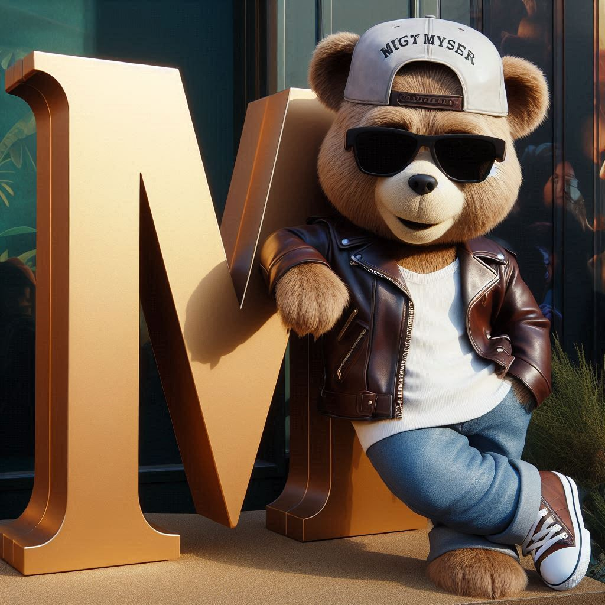

Yo:

Diseña la mascota de un equipo de baseball llamada Oso Monty, donde el diseño debe ser una imágen vivida donde el oso use lentes oscuros, la gorra hacia atrás, empleando una chamarra de cuero y en donde el oso se apoye en una letra M de gran tamaño

Copilot:
Voy a intentar crear eso.

Yo:

Agrega un bate de béisbol  y un guante y pelota

Copilot:
Voy a intentar crear eso.

